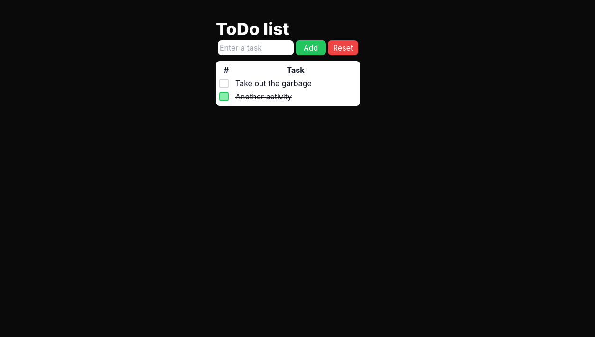

# Simple-ToDo-App
Basic ToDo app that everybody has done.

### Project description
Project was made using Next.js 15 and Tailwind CSS. It allows:
- Adding tasks to the list
- Marking tasks as done
- Resetting whole list

Just as every ToDo app. All data is stored in localStorage. Maybe in future I'll make more advanced version. [Go see it by yourself!](https://simple-to-do-app-livid.vercel.app/)

### Demo
The app looks as follows:

